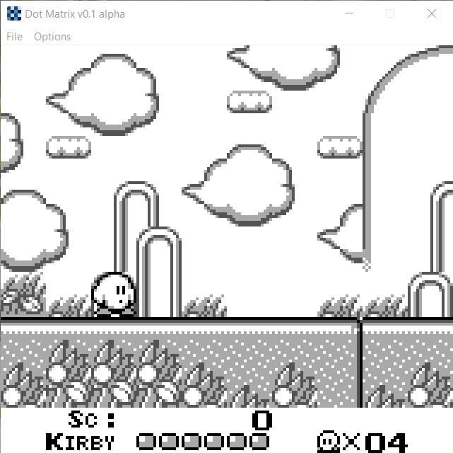

# Dot Matrix: Project Status

## May 17th 2023
Game Boy Color mode is mostly working. Added a new app icon and splash screen.

  
  
  
  
  
  

## May 7th 2023
After three years of inactivity, I decided to finally come back to working on this emulator. I am rewriting the code to be cleaner, and I will be continuing to fix bugs in the emulator code. I will also be implementing sound as well as Game Boy Color mode.

Certain games that never worked in the old emulation code now work! Some of these games include:
- Alleyway (had to properly implement serial interrupt)
- Super R.C. Pro-Am (had to correct lcd stat interrupt)

I've also added several new palettes, as well as a new splash screen.

  
  
  
  

## May 25th 2020
Added support for MBC5. Emulator now supports No-Bank, MBC1, MBC2, MBC3, and MBC5. Emulator now saves games properly as well. I have released an executable for this version (0.5 Beta) and plan to take a break from this project in order to work on other projects.

  
  

## May 4th 2020
Changed UI background and icon. Small revisions have also been made under the hood. Plan to finish implementing several banking methods next. Also, Pokemon is working (without save feature).

  
  
  
  
  
  

## April 20th 2020
Revised UI and added palettes. Video is now completely implemented. However, some games still have bugs that I am trying to work out.

  
  
  
  
  
  

## April 17th 2020
Both Tetris and Dr. Mario are now working correctly. Will next work on finishing video implementation

  
  
  

## April 16th 2020
Dr. Mario appears to be working. There is a small bug that I need to fix in the game though. Joypad is also now properly implemented.

  
  

## April 11th 2020
Tetris finally boots. Took me a bit to find the bug that prevented it from booting!

  

## Feb 14th 2020
The Nintendo logo is scrolling!!!

  

